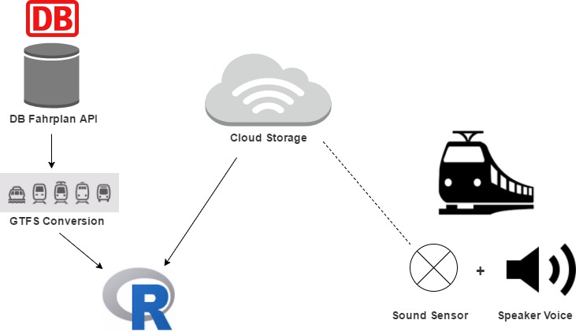
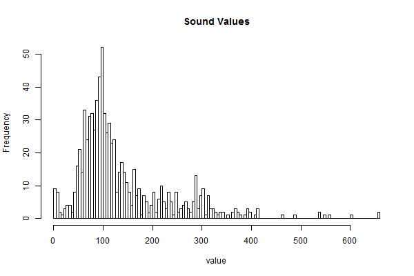

# Railax: Bringing Peace to Your Journey

### By Team _Railax_

_A fun weekend project by Emelie Hofland and Jaime González-Arintero. Created during the [DB Open Data Hackathon](https://www.mindboxberlin.com/index.php/db-hackathon-may-2017.html) in Berlin, on May 12-13, 2017._

<Pictures and additional media of the **project presentation at the hackathon** can be found in [this folder](./hackathon).>

## Introduction

Sometimes, you want to enjoy a quiet train trip, get some work done, read something, or chill. Or just have a _siesta_!

But suddenly, a bunch of noisy (and annoying) people jumps in the train, and your peace is gone. Oh, that weekly football match that attracts all hooligans. And them all want to sit close to you. Say _"bye, bye"_ to that peaceful moment, my friend.

Wouldn't it be nice to **know in advance what to expect from your trip**?

## Description

The goal of this project is to collect data from a noise / loudness sensor, and combine it with other (travel) data (weekday, time, segment, and more). Eventually, predictions can be made on how busy or quiet your next trip will be.

For this, real data from the Deutsche Bahn _Fahrplan_ API was used, as well as an affordable loudness sensor (to have a "real world" proof of concept).

All the data was later processed and represented with [R](https://www.r-project.org). The sensor node was programmed in [Arduino](https://en.wikipedia.org/wiki/Arduino). An additional dashboard for real-time notifications was built in [Node-RED](https://nodered.org), and the "predictive" dashboard (with all the routes) was created using [Microsoft Power BI](https://powerbi.microsoft.com/en-us/).

## Solution Architecture

### 

## Business Presentation

The **presentation** is available in [Google Slides](https://docs.google.com/presentation/d/1oejwr1haGwi5W9faB8-4qU1_rS6nwdFyooUE9Pdaowk/edit?usp=sharing) (**Chrome is recommended**; other browsers such as Safari may show format issues).

A static **PDF version** can be downloaded [here](./assets/railax-biz-slides.pdf).

The additional pictures used in this presentation are available on [this Google Drive folder](https://drive.google.com/open?id=0B8B9qWtOwkjAS01FYlZyU1liUzg), in the `pics` directory.

## Technical Setup

### Play a _"Please Be Quiet"_ Message when the Noise Level is Too High

We want a pleasant voice to kindly remind people to keep their mouth shut. Luckily, there are many TTS (TextToSpeech) services online out there - and also free ones. I used [texttospeech](http://www.fromtexttospeech.com/) to create an audio file we could use.

Text English: _Dear Passengers, I would like to kindly remind you that this is a silent wagon._

Text German: _Liebe Passagiere, ich möchte Sie freundlich daran erinnern, dass Sie sich in einem stillen Wagen befinden. Vielen dank für Ihre verständnis_.

### Find a Python Library to Play MP3 Files

```python
from pygame import mixer # Load the required library

mixer.init()
mixer.music.load('D:/railax-take-it-easy/assets/silent-coupe-deutsch.mp3')
mixer.music.play()
```

It works! Just need to not forget to run `music.load` each time before playing (otherwise it does not work).

### Connect the Noise Sensor to the Cloud

---DOCS IN PROGRESS!---

To connect the noise / loudness sensor to the cloud, and start sendind real-time values, head to [this tutorial](./sensor-nodes).

### What Is an Average Value? Inspect Sound Values in R

We collected some live stream sound values from our sensor in R and explored the values.

It seems that the value does not often go over 600 (the original value we had in mind to set as a trigger), even in a noisy room. Therefore we put the trigger now at 400. 



### Read the Sound Values in Python & Play the MP3 File

In the [noise_mp3_reaction_python.py](noise_mp3_reaction_python.py) you can find the script that makes the mp3 go off every time the sound sensor hit a value over 400 more than three times.

### Convert DB API Data to GTFS

To make it easy to work with the data in R via the [gtfsr library](https://github.com/ropensci/gtfsr) - we converted the Fahrplan API data for this month into GTFS data - with the help of [this python script](https://github.com/patrickbr/db-api-to-gtfs).

## To-Do

* Add how-to for the sensor node.
* Add offline testing sketches as well.
* Add how-to for the Node-RED dashboard.

## License

Copyright (C) 2017 Emelie Hofland <emelie_hofland@hotmail.com>, Jaime González-Arintero <a.lie.called.life@gmail.com>

Permission is hereby granted, free of charge, to any person obtaining a copy of this software and associated documentation files (the "Software"), to deal in the Software without restriction, including without limitation the rights to use, copy, modify, merge, publish, distribute, sublicense, and/or sell
copies of the Software, and to permit persons to whom the Software is furnished to do so, subject to the following conditions:

The above copyright notice and this permission notice shall be included in all copies or substantial portions of the Software.

Except as contained in this notice, the name(s) of the above copyright holders shall not be used in advertising or otherwise to promote the sale, use or
other dealings in this Software without prior written authorization.

THE SOFTWARE IS PROVIDED "AS IS," WITHOUT WARRANTY OF ANY KIND, EXPRESS OR IMPLIED, INCLUDING BUT NOT LIMITED TO THE WARRANTIES OF MERCHANTABILITY,
FITNESS FOR A PARTICULAR PURPOSE AND NONINFRINGEMENT.  IN NO EVENT SHALL THE AUTHORS OR COPYRIGHT HOLDERS BE LIABLE FOR ANY CLAIM, DAMAGES OR OTHER
LIABILITY, WHETHER IN AN ACTION OF CONTRACT, TORT OR OTHERWISE, ARISING FROM, OUT OF OR IN CONNECTION WITH THE SOFTWARE OR THE USE OR OTHER DEALINGS IN THE
SOFTWARE.
