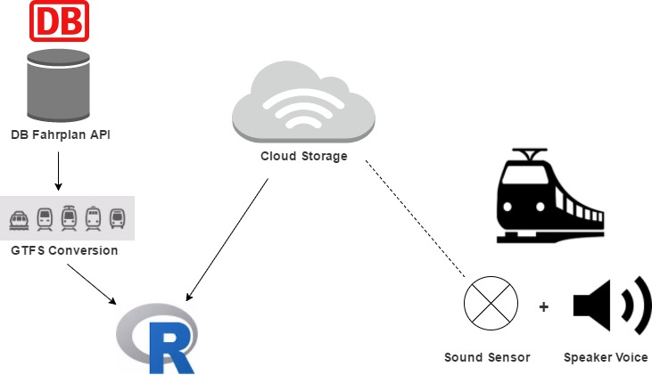
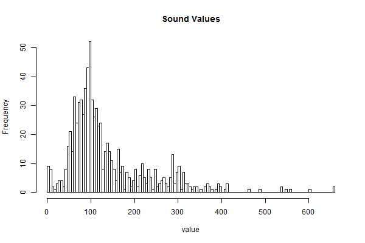

# Railax: Bringing Peace to Your Journey

## Description

Sometimes, you want to enjoy a quit trip, and get some work done - or just have a siesta. But suddenly, it turns out a bunch that a bunch of noisy people jump in the train, and your peace is gone. The weekly football match attract all hooligans to the train. Wouldn't it be nice to know in advance what to expect from your trip? 

The goal of this project is to collect data from a sound sensor and implements it with other (travel) data (weekday, time, segment, etc.) so eventually predictions can be made on how busy/quite your next trip will be. For this we want to use data from the Deutsche Bahn API, sound sensors (fora "real world" proof of concept), R (to process/represent data) and C/Adruino (electronics).

_This project is a result of the DB Mindbox Hackathon Berlin 12-13 May of 2017._

## Solution Architecture

### 

## Business Presentation

Available in [Google Slides](https://docs.google.com/presentation/d/1oejwr1haGwi5W9faB8-4qU1_rS6nwdFyooUE9Pdaowk/edit?usp=sharing) (**Chrome is recommended**; other browsers such as Safari may show format issues).

A static PDF version can be downloaded [here](./assets/railax-biz-slides.pdf).

## Technical Setup

### Play a _"Please Be Quiet"_ Message when the Noise Level is Too High

We want a pleasant voice to kindly remind people to keep their mouth shut. Luckily, there are many TTS (TextToSpeech) services online out there - and also free ones. I used [texttospeech](http://www.fromtexttospeech.com/) to create an audio file we could use.

Text English: _Dear Passengers, I would like to kindly remind you that this is a silent wagon._

Text German: _Liebe Passagiere, ich möchte Sie freundlich daran erinnern, dass Sie sich in einem stillen Wagen befinden. Vielen dank für Ihre verständnis_.

### Find a Python Library to Play MP3 Files

```python
from pygame import mixer # Load the required library

mixer.init()
mixer.music.load('D:/railax-take-it-easy/assets/SilentCoupe_Deutsch.mp3')
mixer.music.play()
```

It works! Just need to not forget to run `music.load` each time before playing (otherwise it does not work).

### Connect the Noise Sensor to the Cloud

---DOCS IN PROGRESS!---

### What Is an Average Value? Inspect Sound Values in R

We collected some live stream sound values from our sensor in R and explored the values.

It seems that the value does not often go over 600 (the original value we had in mind to set as a trigger), even in a noisy room. Therefore we put the trigger now at 400. 



### Read the Sound Values in Python & Play the MP3 File

In the [noise_mp3_reaction_python.py](noise_mp3_reaction_python.py) you can find the script that makes the mp3 go off every time the sound sensor hit a value over 400 more than three times.

### Convert DB API Data to GTFS

To make it easy to work with the data in R via the [gtfsr library](https://github.com/ropensci/gtfsr) - we converted the Fahrplan API data for this month into GTFS data - with the help of [this python script](https://github.com/patrickbr/db-api-to-gtfs).

## To-Do

* Add Arduino sketches for the noise sensor.
* Add offline testing sketches as well.
* Add how-to for the Node-RED dashboard.


