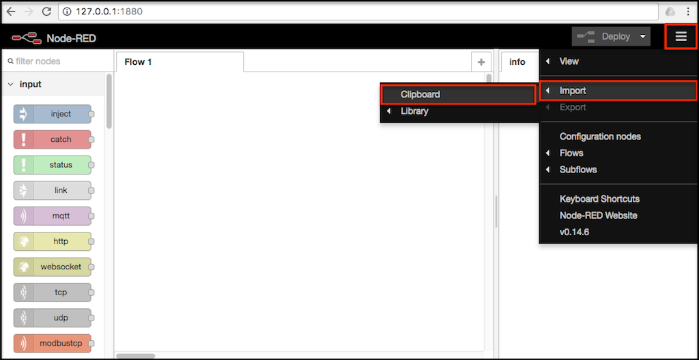
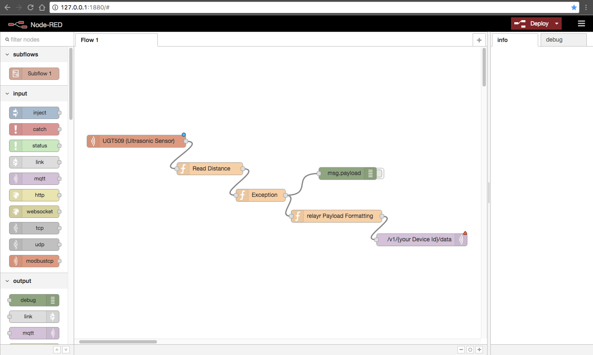
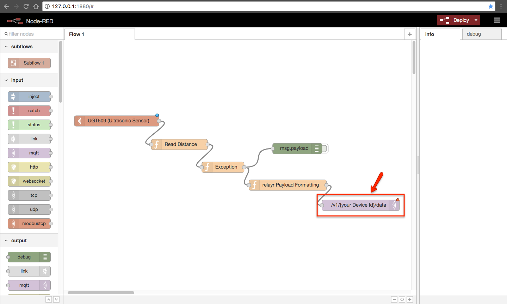
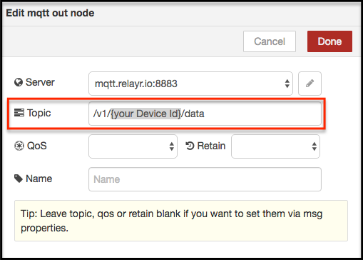
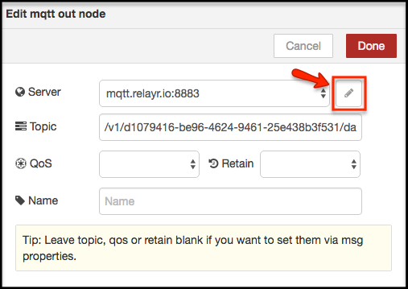
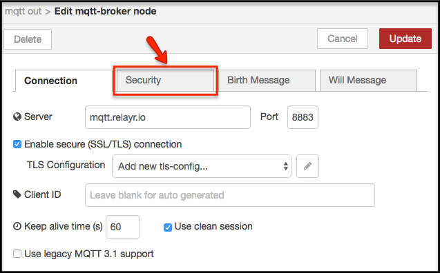
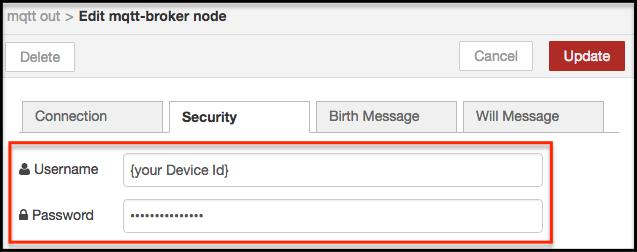

# Real-time Notifications and Noise Level Dashboard

## Introduction

---WORK IN PROGRESS---

[Node-RED](http://nodered.org/) is a visual data flow tool for wiring nodes in the Internet of Things. These nodes can be **virtual** and/or **physical**. Custom logic can be applied to any data flow. e.g., to format the payloads coming from the loudness sensor, in order to show the values in a graph.

Besides, Node-RED can be used to quickly create real-time dashboards, thanks to a contributed package named `UI`.

The Railax Real-time dashboard looks like this:


## Installation and Configuration

---WORK IN PROGRESS---

Node-RED requires Node.js, so first we will have to install it. You may find several guides to do so, but it is recommended to follow [the one available on the Node-RED website](http://nodered.org/docs/getting-started/installation).

If you are already familiar with Node.js, then you can skip this step and proceed with the installation of Node-RED. The easiest way to install Node-RED is to use node’s package manager, **npm**. Installing it as a global module adds the command `node-red` to your system path. Simply open the terminal and run the following command:

```shell
$ sudo npm install -g --unsafe-perm node-red
```

The next step is to run the package in our computer. To do so, open a terminal and execute the following command:

```shell
$ node-red
```

Since Node-RED was installed as a global package, it should work independently of what directory we're currently in.

If everything went well, the last message on the terminal will look like this:

```shell
[info] Server now running at http://127.0.0.1:1880/
```

This means that Node-RED is running locally, and we can start adding our flows. To do so, open a browser and navigate to `http://127.0.0.1:1880/`.

## Importing and Configuring Flows

---WORK IN PROGRESS--

Now we will add our first flow, which will help us read data from the loudness sensor. In Node-RED, the flows can be **imported** (and exported) using JSON format. For the sake of simplicity, the flow needed to implement this project is available in this repository, and ready to use. On the same folder of this readme file, open and copy the following flow: `node-red-flow.json`.

In Node-RED, click on the button in the top right corner and select `Import` → `Clipboard`, as shown below:



On the next window, paste the raw content of the file `node-red-flow.json`, as mentioned before. Now click on the part of the (until now) blank workspace where you want the flow to be placed.

As a result, the workspace should look like this:



### Parameters

---WORK IN PROGRESS--

Now we will configure the flow according to the device that we created in the relayr Cloud. Two parameters are necessary for this step. These can be easily retrieved through the Developer Dashboard. For more info, please click on the embedded links included below.

-  `Device Id`: UUID of the device that will be associated with Vertex. Provided by the relayr platform [when adding a device](http://docs.relayr.io/getting-started/devices-guide/).
-  `Password`: MQTT password. Provided by the relayr platform [when adding a device](http://docs.relayr.io/getting-started/devices-guide/).

### Configuring Flows

---WORK IN PROGRESS--

In this step, we will configure one of the nodes in Node-RED so that the data can reach the relayr Cloud. To start, double click on the node highlighted in this next figure:



A configuration window will open. In the field labeled "Topic," replace `{your Device Id}` with the `Device Id` of your specific device (retrieved from the Developer Dashboard in the previous section).



Once finished, the topic must use this format:  
`/v1/xxxxxxxx-xxxx-xxxx-xxxx-xxxxxxxxxxxx/data`

Now click on the button shown below:



Click on "Security":



In this window, we can enter our MQTT username and password. **For the sake of simplicity, the username and the device Id are the same.** A configuration window will open. In the field labeled "Topic," replace `{your Device Id}` with the `Device Id` of your specific device. In "Password" we must enter the `Password` retrieved from the Developer Dashboard in the previous section.



Once ready, click on **"Update"** to save your changes and close this menu. On the next menu, click on **"Done."**

We're almost there! Now simply **click on the prominent red button in the top right corner which reads "Deploy."** The flow will now start getting data from the cloud, formatting it, and redirecting it to the dashboard.

## To-Do

* Review and update this entire file. It's based on the IO-Link / Modbus tutorial, so most parts don't make sense yet.
* Add screenshot of the finished dashboard on the introduction section.
* Update screenshot of the complete flow deployed on the workspace (right now it shows a flow from the IO-Link / Modbus tutorial).